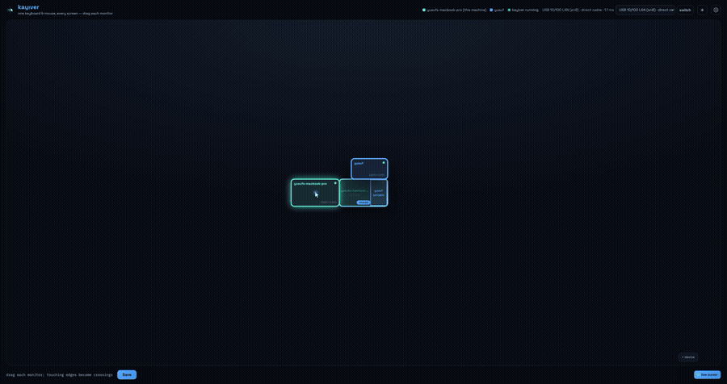

<p align="center"></p>

# Kayıver

[](https://github.com/sponsors/yusufani)
[](https://paypal.me/yusufani)
[](LICENSE)

**One keyboard & mouse, every screen.**

Kayıver is a lightweight, source-available software KVM. Slide your cursor off
the edge of one machine's screen and it appears on the next, exactly like
moving between two monitors of the same computer. Keyboard input follows the
cursor.

<p align="center">
  
  <br>
  <sub>Real footage, fully dark-mode: the cursor crosses from the Mac onto the shared panel and the
  Windows machine takes focus; then the session is moved to Wi-Fi live — watch the RTT badge jump —
  and back to the direct cable, settling at ~1&nbsp;ms.</sub>
</p>

- **Native feel, no lag** — a single ~2.5 MB Rust binary per machine, raw OS
  input APIs (CGEventTap / low-level hooks), relative mouse deltas over
  TCP+`TCP_NODELAY` on your LAN. No Electron, no runtime, no daemon zoo.
  Measured macOS↔Windows over Wi-Fi: **~5 ms round-trip median (~2.6 ms
  one-way)**. On a quiet Wi-Fi link expect occasional spikes from adapter
  power-saving — wired Ethernet or disabling the Wi-Fi adapter's power
  management flattens them.
- **No cursor lock-ups** — the machine that owns the physical mouse flips
  into forwarding mode *inside the OS input callback*, so not one event
  leaks or double-applies during a crossing. A triple-tap of `Esc` always
  yanks the cursor home, even if the remote machine hangs.
- **VPN-proof** — connections try a static address before mDNS discovery,
  so a corporate VPN that blocks multicast doesn't break anything.
- **Secure by default** — one-time PIN pairing (SPAKE2), then every session
  is end-to-end encrypted (Noise `NNpsk0`, ChaCha20-Poly1305).
- **Shared-monitor aware** — one panel cabled to both machines? Mark it in
  the editor; when you flip the panel's input, `kayiver monitor <machine>`
  (or Cmd/Ctrl+Alt+M, the menu-bar item, the editor, or the Android app)
  tells kayiver who the panel is showing: the hidden machine's cursor skips
  over its copy so it can never strand itself on a screen nobody can see,
  crossings through the panel resolve by real monitor geometry, and the
  ownership survives restarts.
- **Fullscreen-game safe** — raw-input games receive true relative mouse
  deltas while the visible cursor is pinned with exact warps (immune to
  pointer acceleration); lock-screen/UAC desktop switches are detected and
  healed, and a game's `ClipCursor` shows up in the log instead of as a
  mystery.
- **Real apps** — a menu-bar app with a native editor window on macOS
  (`packaging/macos/build-app.sh --install` → `Kayiver.app`), tray icon +
  embedded-icon exe on Windows, and an Android companion
  ([apps/android](apps/android)) for remote status + shared-monitor handoff.
- **Autostart** — `kayiver autostart enable` and it's just *there* after boot.

| Platform | Give input (host) | Receive input (client) |
|----------|:-:|:-:|
| macOS    | ✅ | ✅ |
| Windows 10/11 | ✅ | ✅ |
| Linux    | 🚧 planned | 🚧 planned |
| Android  | — | 🚧 planned (see [docs/PLATFORMS.md](docs/PLATFORMS.md)) |
| iOS/iPadOS | 🚧 controller only | ❌ OS restriction (see [docs/PLATFORMS.md](docs/PLATFORMS.md)) |

## Download

Grab the latest build from **[Releases](https://github.com/yusufani/kayiver/releases/latest)**:

- **macOS (Apple silicon):** `Kayiver-macos-arm64.zip` — unzip, move to
  Applications, then **right-click → Open** the first time (the app is
  self-signed, not notarized).
- **Windows 10/11 (x64):** `kayiver-windows-x64.exe` — put it anywhere and run
  it; if SmartScreen appears, choose "More info → Run anyway".

Or build from source:

## Quick start

Build (Rust 1.85+):

```sh
cargo build --release          # -> target/release/kayiver
```

Cross-compile a Windows binary from macOS/Linux (no Rust needed on the
Windows box): install mingw-w64 (`brew install mingw-w64`), then

```sh
rustup target add x86_64-pc-windows-gnu
cargo build --release --target x86_64-pc-windows-gnu   # -> kayiver.exe
```

**1. Pair** (once). On the machine that has the keyboard/mouse:

```sh
kayiver pair
# shows a 6-digit PIN and this machine's IP
```

On the other machine:

```sh
kayiver join <host-ip>
# type the PIN
```

**2. Run** both sides:

```sh
kayiver run
```

**3. Arrange your screens** (drag & drop):

```sh
kayiver ui
```

opens the visual layout editor — a native window on macOS, browser app-window
elsewhere. Drag the machines to match your desk; touching edges become
crossings, and dropping one monitor onto another marks a physically shared
panel. Saving applies **live** to a running host, no restart needed. (Prefer
a file? `kayiver config-path` works too.)

**4. Make it permanent:**

```sh
kayiver autostart enable
```

Now push your cursor against the edge between the machines. That's it.

macOS will ask for **Accessibility** and **Input Monitoring** permissions on
first run (System Settings → Privacy & Security). `kayiver doctor` shows what's
missing.

## Layout

Pairing creates a default layout (new machine to the right of the host).
`kayiver ui` is the comfortable way to change it; under the hood it writes:

```toml
[[layout.links]]
from = "mac-studio"     # when mac-studio's cursor exits its...
edge = "right"          # ...right edge...
to = "win-desktop"      # ...it enters win-desktop (from the left)
```

Links are bidirectional; positions map proportionally between different
resolutions. Any edge (`left`/`right`/`top`/`bottom`) works, and you can
chain machines: `mac ⇄ win ⇄ tablet`.

## On a VPN / multicast-blocked network?

Pairing stores the host's address, and clients always try it before mDNS:

```toml
[[peers]]
name = "mac-studio"
addr = "10.8.0.3:24817"   # update if the host IP changes
```

Only TCP port **24817** (configurable) between the machines is required.

## Troubleshooting

| Symptom | Fix |
|---|---|
| Cursor won't cross | `kayiver doctor` on both sides: are they connected? Portal edges only arm when the peer is online. |
| Cursor stuck on remote machine | Triple-tap `Esc` — input snaps back to the host. |
| "CGEventTapCreate failed" on macOS | Grant Accessibility + Input Monitoring to your terminal (or the kayiver binary), then restart kayiver. |
| Not discovered over Wi-Fi | Multicast may be filtered; set `addr` on the client's peer entry (see above). |
| Occasional lag spikes | Wi-Fi adapter power-saving. Use Ethernet, or disable "Allow the computer to turn off this device" on the adapter. |
| Keys stuck after crossing | Shouldn't happen (both sides release held keys on every focus change) — file a bug with `RUST_LOG=debug` output. |
| Need logs from a background instance | Set `KAYIVER_LOGFILE=/path/to/kayiver.log` before launching; every event is written and flushed there. |

## The desk it's tested on

Every commit ships to a real desk and has to survive it before it lands on
`main`:

- **Host:** MacBook Pro (Apple silicon), 2560×1440 main screen — signed
  `Kayiver.app`, menu-bar UI.
- **Client:** Windows 11 desktop — tray exe, autostarted into the interactive
  console session by a scheduled task.
- **Shared panel:** one 2560×1440 monitor cabled to *both* machines;
  ownership flips with the monitor's input switch + Ctrl/Cmd+Alt+M.
- **Extra screen:** a Windows-only 1920×1080 sitting physically *above* the
  shared panel — reachable from the Mac straight up through the panel, by
  pure geometry.
- **Third device:** an Android tablet on the left edge via scrcpy (wireless,
  with an idle heartbeat that defeats Wi-Fi power saving).
- **Network:** ordinary Wi-Fi LAN, ~5 ms median RTT.

The same setup is on the project page: **[yusufani.github.io/kayiver](https://yusufani.github.io/kayiver/)**.

## Support

Kayıver is MIT-licensed and always will be. If it saved your desk from a
hardware KVM (or a second keyboard), consider fueling the next platform —
Linux is on the bench:

**[GitHub Sponsors](https://github.com/sponsors/yusufani)** ·
**[PayPal](https://paypal.me/yusufani)**

## Testing without hardware

`cargo test --features sim -p kayiver` runs the full engine — real router,
real Noise encryption, real TCP — on a **virtual two-machine desk** with
scriptable monitors, cursor, and injection. Every bug class from the real
desk has a regression scenario there. See [docs/TESTING.md](docs/TESTING.md).

## Documentation

- [docs/ARCHITECTURE.md](docs/ARCHITECTURE.md) — components, threads, the crossing state machine, latency design
- [docs/TESTING.md](docs/TESTING.md) — the simulated two-machine test desk
- [docs/PROTOCOL.md](docs/PROTOCOL.md) — wire protocol specification
- [docs/SECURITY.md](docs/SECURITY.md) — threat model, pairing & session crypto
- [docs/PLATFORMS.md](docs/PLATFORMS.md) — per-OS implementation notes, Android/iOS plans, shared-monitor (DDC/CI) story
- [docs/ROADMAP.md](docs/ROADMAP.md) — what's next

## License

**Free for personal use.** Kayıver is licensed under the
[PolyForm Noncommercial License 1.0.0](LICENSE): individuals and other
noncommercial users can use it freely. **Companies and any commercial use
need a commercial license** — get in touch: **yusuf.ani@dbrain.tech**.
